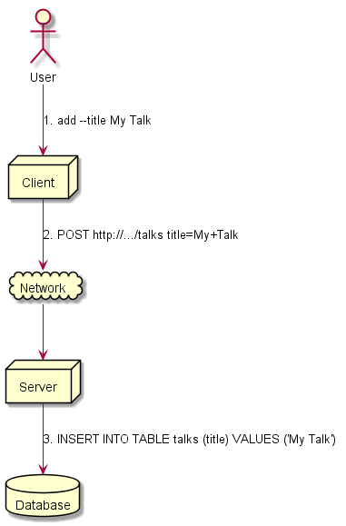
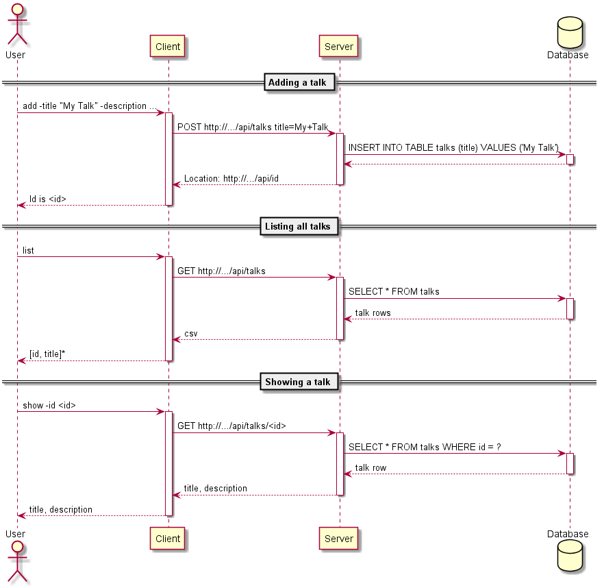
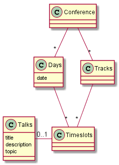

# PGR200 Hovedinnlevering

Innleveringsfrist: 12. november kl 09:00. **Viktig:** WiseFlow *stenger* når fristen er ute - lever i tide.

Tag koden med `innlevering` i GitHub og last opp en ZIP-fil til WiseFlow. Dersom du ikke fikk godkjent innlevering #1 eller #2 i første runde, last opp zip-fil av disse i tillegg.

## Oppgave

Du har funnet en konferanse du er interessert i å gå på, men du har ikke råd til billetten. Men frykt ikke: etter at du tok kontakt med de som organiserer konferansen fikk du høre at du kunne få gratisbillett dersom du hjelper til å lage noe programvare for konferansen.

Oppgaven din: lag en server for appen som inneholder konferanseprogrammet i en database. Funksjonaliteten må som et minimum tillate at man legger inn og lister ut foredrag på konferansen. Du bruke datamodellen angitt under eller forenkle eller endre den slik du selv ønsker.

Programmet skal følge god programmeringsskikk: Det skal ha enhetstester, det skal ha en god README-dokumentasjon, det skal hente inn konfigurasjon fra en .properties-fil. Fila skal ligge i current working directory, hete `innlevering.properties` og inneholde properties `dataSource.url`, `dataSource.username` og `dataSource.password`. Når vi evaluerer oppgaven ønsker vi å bruke egne verdier for disse. Prosjektet bør også bygge automatisk på [Travis CI](https://travis-ci.com).

Pass på at det er godt med tester, at koden kompilerer og kjører ok med "mvn test" og at du beskriver hvordan man tester løsningen manuelt.

Eksempel kjøring (inkluder dette i README.md-fila deres):

```bash
> mvn test
[INFO] Scanning for projects...
[INFO] ------------------------------------------------------------------------
[INFO] Building conference-server 0.1-SNAPSHOT
[INFO] ------------------------------------------------------------------------
[INFO]
[INFO] --- maven-compiler-plugin:3.1:compile (default-compile) @ conference-server ---
[INFO] Compiling 25 source files to e:\Profiles\jbrodwal\workspaces\demo\conference-server\target\classes
[INFO]
[INFO] --- maven-compiler-plugin:3.1:testCompile (default-testCompile) @ conference-server ---
[INFO] Changes detected - recompiling the module!
[INFO] Compiling 9 source files to e:\Profiles\jbrodwal\workspaces\demo\conference-server\target\test-classes
[INFO]
[INFO] --- maven-surefire-plugin:2.12.4:test (default-test) @ conference-server ---

-------------------------------------------------------
 T E S T S
-------------------------------------------------------
....
> mvn install
[INFO] Scanning for projects...
[INFO] ------------------------------------------------------------------------
[INFO] Building conference-server 0.1-SNAPSHOT
[INFO] ------------------------------------------------------------------------
[INFO]
...
[INFO] --- maven-jar-plugin:2.4:jar (default-jar) @ conference-server ---
[INFO] Building jar: e:\Profiles\jbrodwal\workspaces\demo\conference-server\target/conference-server-0.1-SNAPSHOT.jar
[INFO]
[INFO] --- maven-shade-plugin:3.1.1:shade (default) @ conference-server ---
[INFO] Including org.postgresql:postgresql:jar:42.2.2 in the shaded jar.
[INFO] Replacing original artifact with shaded artifact.
[INFO] ------------------------------------------------------------------------
[INFO] BUILD SUCCESS
[INFO] ------------------------------------------------------------------------
[INFO] Total time: 12.565 s
[INFO] Finished at: 2018-07-08T17:18:12+02:00
[INFO] Final Memory: 21M/211M
[INFO] ------------------------------------------------------------------------
> psql --username postgres --command="create database ... with owner .."'
> Oppdater innlevering.properties med dataSource.url, dataSource.username, dataSource.password
> java -jar target/database-innlevering.jar resetdb
> java -jar target/database-innlevering.jar insert "Mitt foredrag"
> java -jar target/database-innlevering.jar list
```

Som en del av semesterarbeidet skal dere levere en video på 3-8 minutter. Dersom dere har laget dette i forbindelse med innlevering #1 eller innlevering #2 kan dere bare legge ved denne video. I motsatt fall skal dere ta opp en video for mappeinnleveringen på 3-8 minutter der dere parprogrammerer. Velg gjerne en bit med kode som dere refactorerer. Screencast-o-matic anbefales som verktøy for video-opptaket, men andre verktøy kan benyttes. En lenke til videoen skal leveres og ikke videoen selv. Husk å åpne for tilgang til videoen ("unlisted" i Youtube) og legge inn lenke fra README.

Dere skal også gi tilbakemelding på en annen gruppes besvarelse. Tilbakemeldingen skal skrives i en egen fil (tilsvarende format som en README-fil) og inkluderes både i deres prosjekt og den andre gruppens prosjekt. Tilbakemeldingen dere har mottatt skal ligge i en fil som heter `MOTTATT-TILBAKEMELDING.md` og tilbakemeldingen dere har gitt skal hete `GITT-TILBAKEMELDING.md`.

I tilbakemeldingen er det lurt å stille spørsmålene: 1. Hva lærte jeg av denne koden? 2. Hva forsto jeg ikke av denne koden? 3. Hva tror jeg forfatterne av koden kunne ha nyttig av å lære?

### Arkitektur



### Programflyt



### Forslag til datamodell



## Sjekkliste for innleveringen

- [ ] Kodekvalitet
  - [x] Koden er klonet fra GitHub classrom
  - [ ] Produserer `mvn package` en executable jar? (tips: Bruk `maven-shade-plugin`)
  - [ ] Bruker koden Java 8 og UTF-8
  - [ ] Bygger prosjektet på [https://travis-ci.com](https://travis-ci.com)?
  - [ ] Har du god test-dekning? (tips: Sett opp jacoco-maven-plugin til å kreve at minst 65% av linjene har testdekning)
  - [ ] Er koden delt inn i flere Maven `<modules>`?
  - [ ] Bruker kommunikasjon mellom klient og server HTTP korrekt?
  - [ ] Kobler serveren seg opp mot PostgreSQL ved hjelp av konfigurasjon i fila `innlevering.properties` i *current working directory* med `dataSource.url`, `dataSource.username`, `dataSource.password`?
- [ ] Funksjonalitet
  - [ ] add: Legg til et foredrag i databasen med title, description og topic (valgfritt)
  - [ ] list: List opp alle foredrag i basen med et valgfritt topic
  - [ ] show: Vis detaljer for et foredrag
  - [ ] update: Endre title, description eller topic for et foredrag
  - [ ] Valgfri tillegg: Kommandoer for å sette opp hvor mange dager og timer konferansen skal vare og hvor mange parallelle spor den skal inneholde.
- [ ] Dokumentasjon i form av README.md
  - [ ] Navn og Feide-ID på dere de som var på teamet
  - [ ] Inkluderer dokumentasjonen hvordan man tester ut funksjonaliteten programmet manuelt? (Inkludert eventuell ekstra funksjonalitet dere har tatt med)
  - [ ] Inkluderer dokumentasjonen en evaluering av hvordan man jobbet sammen?
  - [ ] Inkluderer dokumentasjonen en screencast av en parprogrammeringsesjon?
  - [ ] Inkluderer dokumentasjonen en evaluering *fra* en annen gruppe og en evaluering *til* en annen gruppe?
  - [ ] Inkluderer dokumentasjonen en UML diagram med datamodellen?
  - [ ] Inkluderer dokumentasjonen en link til screencast av programmeringsesjon?
  - [ ] Inkluderer dokumentasjonen en egenevaluering med hvilken karakter gruppen mener de fortjener?

### Forberedelse

- [ ] Finn endelig grupperpartner innen 1. november
- [ ] Finn en gruppe for gjensidig evaluering innen 1. november

### Innlevering

- [ ] Gi veilederne `hakonschutt` og `mudasar187` tilgang til repository
- [ ] Tag koden med `innlevering` i GitHub
- [ ] Ta en zip-eksport fra GitHub
- [ ] Last opp zip-fil i WiseFlow
- [ ] Dersom innlevering #1 eller innlevering #2 ikke ble godkjent *i WiseFlow*, last opp zip-fil med hver av disse innleveringene

## Retningslinjer for vurdering

### Minimum krav for bestått

- Kompilerende kode som er sjekket inn i GitHub
- Tester som gjør noe ikke totalt ufornuftig (eksempel på ufornuftlig `assertTrue(true)` eller `assertEquals(4, 2+2)`)
- Kjørbart program som legger inn data i databasen

### Minimum krav for C

- Skriv og les programmet fra databasen i Java i henhold til deres egen dokumentasjon
- Les og skriv data over socket
- Kode lagret på GitHub, kompilerer og utfører en oppgave uten å krasje

### Minimum krav for B

De fleste av følgende må være oppfyllt:

- Et rimelig nivå med enhetstester som kjører på Travis CI
- Kode uten større skrivefeil, feil innrykk, slukte exceptions eller advarsler fra Eclipse
- Readme som beskriver 4-10 steg for å demonstrere programmet
- God kode: Enkel, konsis, uttrykksfull, velformattert kode uten vestlige feil eller mangler
- Ingen alvorlige feil, SQL injection hull, krasj ved uventet input

### Krav for A

Løsningen må oppfylle alle krav til B og ha 2-3 områder som hever den ytterligere:

- Velskrevet (men ikke nødvendigvis omfattende) dokumentasjon
- At videoen får fram kvalitetene i designet
- Uttrykksfulle enhetstester som er effektive på å fange feil og som kjører på Travis CI
- En velbegrunnet datamodell med 4-8 klasser
- En lettfattelig og utvidbar http-server
- Spennende generisk kode som egentlig er unødvendig kompleks for å løse problemet
- Enkel kode som løser problemet presist og konsist (i konflikt med forrige)

Grupper på 3 må ha flere av disse enn grupper på 2 for å få en A.
